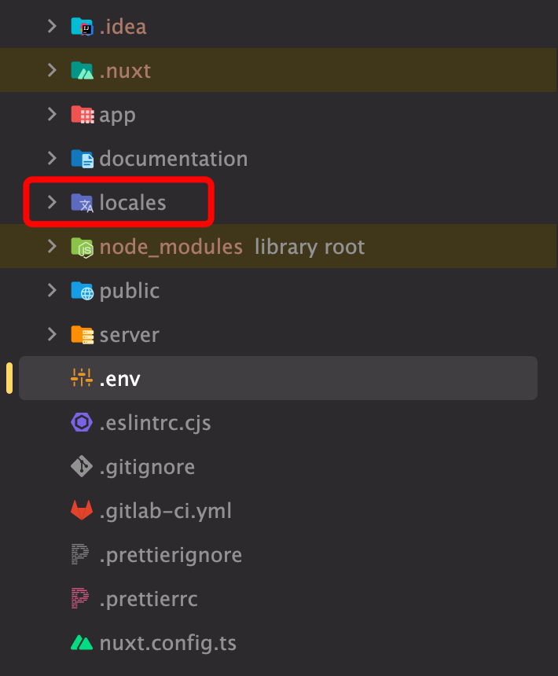
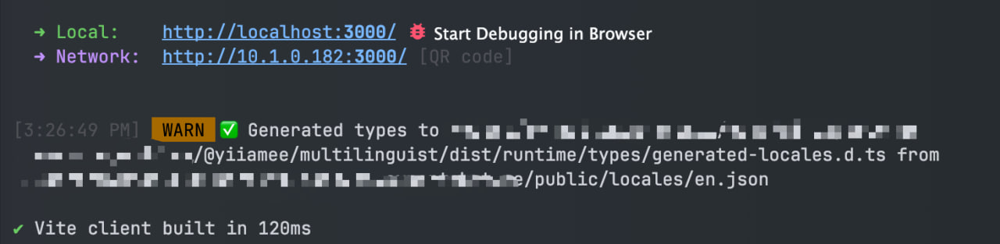
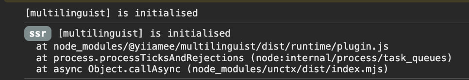
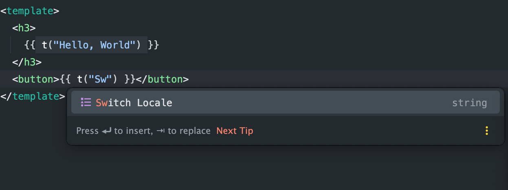
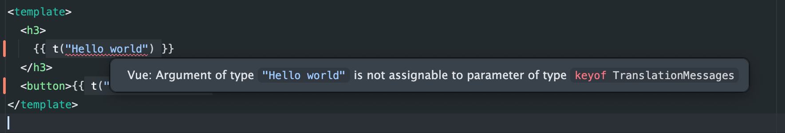

# Nuxt Multilinguist module

Multilinguist is a simple but smoothly working module for easy and seamless localization implementation for Nuxt
applications.

## Key Features

- Easy translations that you're used to
- Works perfectly fine on both SSR + CSR
- No memory leaks and running out of memory errors
- Autocompletion & validation of keys
- Autodetection of browser's locale

## Installation

```bash
npm install @yiiamee/multilinguist
```

Then, add the module to your nuxt.config

```nuxt.config.ts
export default defineNuxtConfig({
    modules: [
        "@yiiamee/multilinguist",
    ],
    multilinguist: {
        defaultLocale: "en", // string representing key to your default (fallback) locale
        supportedLanguages: ["en", "es"], // array of strings representing all available locales' keys
    },
})
```

Then, create a "locales" directory in root directory of your project.



Now, you're ready to use Multilinguist Module!

After running your project, you can see the following warning:



**Dont be scared**, this is just a message from the module, indicating that your locales are typed, and that the module
can properly perform type-checks and autocompletion.

Also, on both SSR and CSR, you will see the following message:



It indicated that the module has been initialized successfully.

To disable logs, you can set the `logging` option in your nuxt.config to `false` (by default, it is `true`):

```nuxt.config.ts
export default defineNuxtConfig({
    modules: [
        "@yiiamee/multilinguist",
    ],
    multilinguist: {
        defaultLocale: "en",
        supportedLanguages: ["en", "es"],
        logging: false, // Boolean value to define if the module should send internal logs to console
    },
})
```
Also, Multilinguist offers a functionality to set the default browser's locale as default if it is available in the supported languages array.

To disable this option, you can set the `setBrowserLanguage` option to `false` as it is `true` by default:

```nuxt.config.ts
export default defineNuxtConfig({
    modules: [
        "@yiiamee/multilinguist",
    ],
    multilinguist: {
        defaultLocale: "en",
        supportedLanguages: ["en", "es"],
        logging: false,
        setBrowserLanguage: false, // by default: true
    },
})
```

Also, if you want to use a different folder name for your locales' files, or you want to specify other path to the directory, you can set the `localesPath` option in your nuxt.config:

```nuxt.config.ts
export default defineNuxtConfig({
    modules: [
        "@yiiamee/multilinguist",
    ],
    multilinguist: {
        defaultLocale: "en",
        supportedLanguages: ["en", "es"],
        logging: false,
        setBrowserLanguage: false, // by default: true
        localesPath: "./languages", // by default: "./locales"
    },
})
```

### Important! Keep in mind, that it is not recommended to use "public" folder for your locales' files, as it may lead to rendering, security and other issues.

# Usage

### t()—famous translate function

```vue

<script setup lang="ts">
  const { t } = useMultilinguist(); // Call useMultilinguist composable to get the translation function

  const pageTitle = computed(() => {
    return t("Hello, World");
  });
</script>

<template>
  <h3>{{ pageTitle }}</h3>
  <button>{{ t("Switch Locale") }}</button>
</template>
```

It also supports nested keys and dynamic keys with variables;
you only need to pass the second argument, an object with used in the key variables:

```vue

<template>
  <span>{{ t("Paste your variable here", { variable: locale }) }}</span>
</template>
```

And your JSON must look like that:

```json
{
  "Paste your variable here": "Here is your variable: {variable}"
}
```

```vue

<script setup lang="ts">
  const { t } = useMultilinguist(); // Call useMultilinguist composable to get the translation function

  const pageTitle = computed(() => {
    return t("Hello, World");
  });
</script>

<template>
  <h3>{{ pageTitle }}</h3>
  <button>{{ t("Switch Locale") }}</button>
  <br />
  <span>{{ t("Paste your variable here", { variable: locale }) }}</span>
  <br />
  <h1>{{ t("nested.Nested key") }}: <span>{{ t("nested.Language") }}</span></h1>
</template>
```

You can already see how keys auto-completion works:



And validation:



### Set another value to the current locale:

```vue

<script setup lang="ts">
  const { t, setLocale } = useMultilinguist();
  // setLocale function accepts a string that should match one of defined
  // in the nuxt.config strings from supportedLanguages array

  const pageTitle = computed(() => {
    return t("Hello, World");
  });
</script>

<template>
  <h3>{{ pageTitle }}</h3>
  <button @click="setLocale('es')">{{ t("Switch Locale") }}</button>
</template>
```

### Get current locale

```vue

<script setup lang="ts">
  const { t, setLocale, locale } = useMultilinguist();
  // locale is SSR friendly, shared among the app ref state  

  const pageTitle = computed(() => {
    return t("Hello, World");
  });
</script>

<template>
  <h3>{{ pageTitle }}</h3>
  <h6>Current Locale: {{ locale }}</h6>
  <button @click="setLocale('es')">{{ t("Switch Locale") }}</button>
</template>
```

### Get locales list

```vue

<script setup lang="ts">
  const { t, setLocale, locale, locales } = useMultilinguist();
  // Locales is a computed ref, which value is being set from your nuxt.config

  const pageTitle = computed(() => {
    return t("Hello, World");
  });
</script>

<template>
  <h3>{{ pageTitle }}</h3>
  <h6>Current Locale: {{ locale }}</h6>
  <span
    v-for="localeItem from locales"
    :key="localeItem"
  >
    | {{ localeItem }} |
  </span>
  <button @click="setLocale('es')">{{ t("Switch Locale") }}</button>
</template>
```